# This is a simple document on how I made my proton pack cable with connectors. Its pretty straight forward

1. My pack is not a Q-Pack, but my Wand is from the MK2.1 STL's
  a. I highly recommend printing the Q-Pack
2. My pack is an 80% pack. It is not a full size, but it shouldn't matter.
3. I am using the GBFan's Sound board, and GBFans wand board
4. The GBFANS soundboard and wand use a 14 pin ribbon cable.
     I used a 20 pin connector, with a 20 wire cable. I wanted to run additional electronics from the wand to the pack.  You don't have to connect all the terminals to make the cable work. I only used 16.   
5. My Pack to Wand cable is 6 feet long with the connectors end to end

**Tools I used**
1) Dremel or Grinder or Belt Sander
2) Soldering Iron and solder
3) A vice or something to hold the cable and connector still during soldering
4) Multi-Meter for testing
5) Hot Glue gun and glue
6) Heat gun or lighter for heat shrink

**Parts I used**
- Connector: 20pin Aviation connector 24mm plug connector CX24 circular connector pin Male & Female plug socket (Buy a couple of them for spares.)
https://www.aliexpress.com/item/4000573125575.html?spm=a2g0s.9042311.0.0.3f6d4c4dVLYjMa

- Core Cable: 20 cores 3 meters + 24AWG | Multi-core shielded cable anti-interference control signal wire https://www.aliexpress.com/item/4000717088080.html?spm=a2g0s.9042311.0.0.11024c4dwnk6AB
- Ribbon Cables:
  1. Wand\Handle 30cm Ribbon Cable: https://www.amazon.com/gp/product/B07Q2SMN9H
  2. Pack 50cm Ribbon Cable*:  https://www.amazon.com/gp/product/B07D4CTZQG
   [* Measure your pack using some string to ensure you get a long enough ribbon cable. My pack is a 80%. The Q-Pack will probably need a longer cable]

- Loom cover: 10 feet of 3/4 inch non-split loom: https://www.amazon.com/gp/product/B07D4CTZQG (Only 6 feet needed.)

- Heat Shrink tubing: https://www.amazon.com/gp/product/B07D4CTZQG
- 4x M3 screws.  (I think my are 8mm in length. Whatever works for your pack)

Wand Handle STL's (Q-Pack) 
- [b_handle_02_forSeparatedGrip.stl ](https://github.com/mr-kiou/q-pack/blob/MK3/WAND/Back_handle/STL/b_handle_02_forSeparatedGrip.stl)
- [b_handle_03_type1.stl](https://github.com/mr-kiou/q-pack/blob/MK3/WAND/Back_handle/STL/b_handle_03_type1.stl)
  
**Full Size Open Source Ghostbusters Proton Pack**
- Quentin Machiels' Q-Pack** https://github.com/mr-kiou/q-pack

**The 80% size Ghostbusters Proton Pack I used**
- MileyORiley 80% Proton Pack: https://www.thingiverse.com/thing:2479141
(I didn't know about the Q-Pack until after I finished my 80% pack)

**GBFans.com Parts**
- Sound Board: https://gbfans.com/shop/pack-parts/amplified-sound-board/
- Wand Kit: https://gbfans.com/shop/pack-parts/proton-gun-wand-light-kit/

Measure everything with the cables routed how you want them in the pack. You don't want to cut or order a cable that is too short.

**Wand Internal Cable**
Parts (Names I am using in the pictures... )
- Handle
[b_handle_02_forSeparatedGrip.stl](https://github.com/mr-kiou/q-pack/blob/MK3/WAND/Back_handle/STL/b_handle_02_forSeparatedGrip.stl)

- Connector Mount 
[b_handle_03_type1.stl](https://github.com/mr-kiou/q-pack/blob/MK3/WAND/Back_handle/STL/b_handle_03_type1.stl)

- 30cm Ribbon Cable Wand\Handle 30cm Ribbon Cable: https://www.amazon.com/gp/product/B07Q2SMN9H

- 20 pin Male Connector 

- A small length of wires for your 20 strand cable

1) To assemble this part had to to grind the Male connector down so it was rounded off and matched the Connector mount.  The male connector has flanges for the screws that you wont want poking out.  

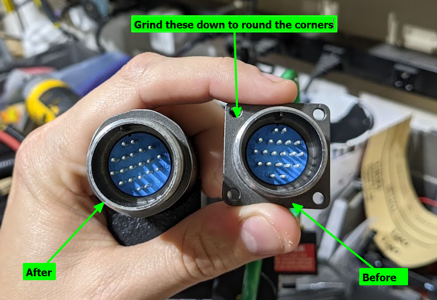

2) I took a small 5 inch piece of the 3 meter cable and soldered onto each of the terminal pins of the mail connector, and then slide some heat shrink tubing on each one to keep them connected. Basically. I used wires to extended the pins. Its a pain to solder the ribbon wire directly to the terminal pins.  **Tip:Start soldering the cables from the middle (Pin 10) and then move outward. Its gets crowded.**
   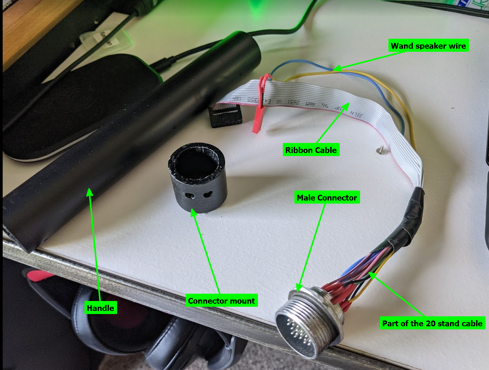
3) Cut one end of the ribbon cable off, and split the wires out.  Slide heat shrink tubing on first. Then solder each wire starting to wire extensions. The ribbon wires are 1 through 14.  Solder the red ribbon wire to Pin 1, then the next wire to pin 2, and so on...  
4) use your lighter or heat gun to seal the heat shrink tubing. 
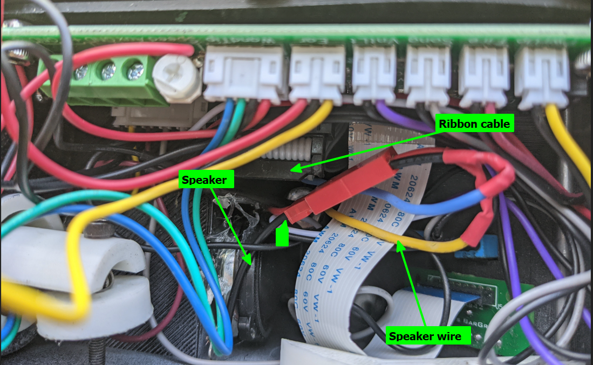

5) I added a speaker into my wand.  I used pins 15 and 16 for positive and negative and put a connector on it. Its an old tweeter speaker. I connected some ends to it and hot glued it into the wand
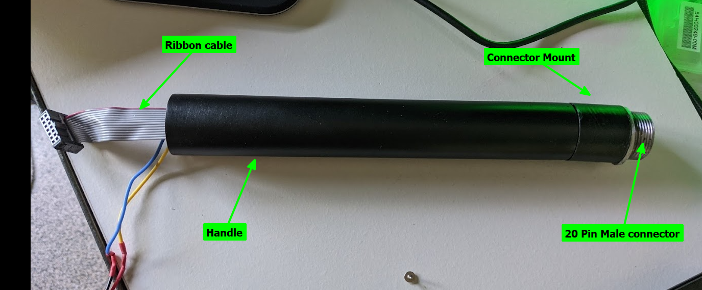

6) assemble. I used hot glue to connect the "connector mount"  and the  Male connector.  It works fine, and can be removed if needed. I wish the "connector mount" was threaded, but this is a custom job. :-D

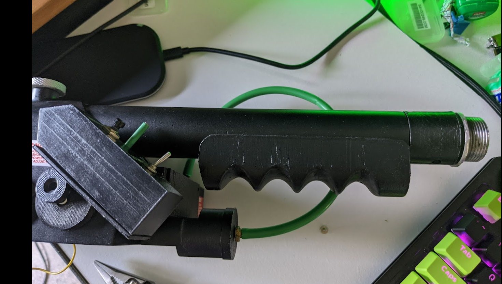
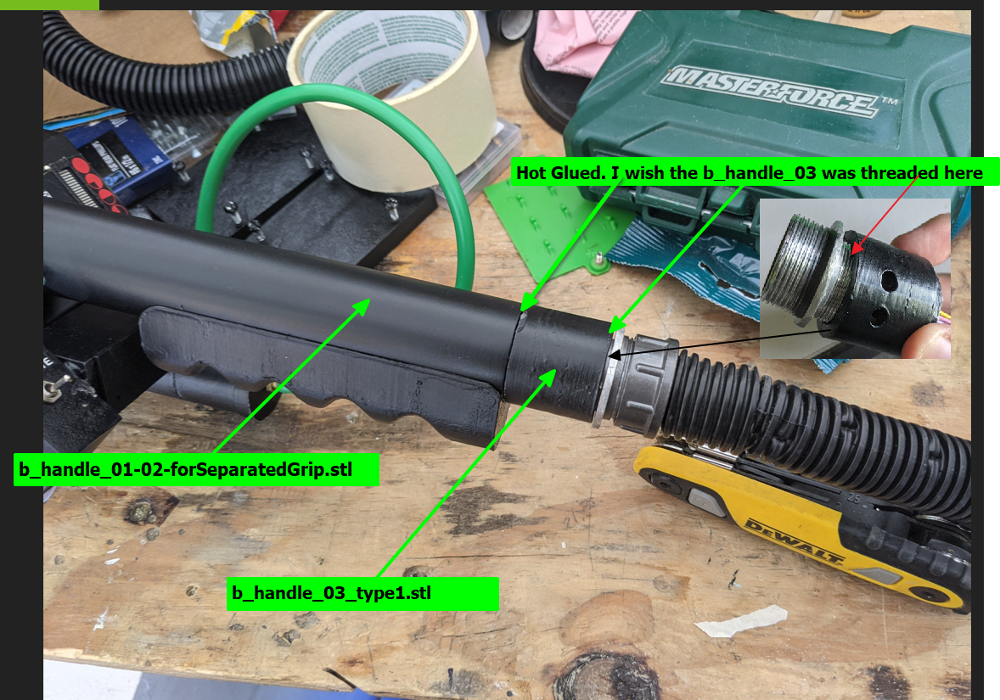
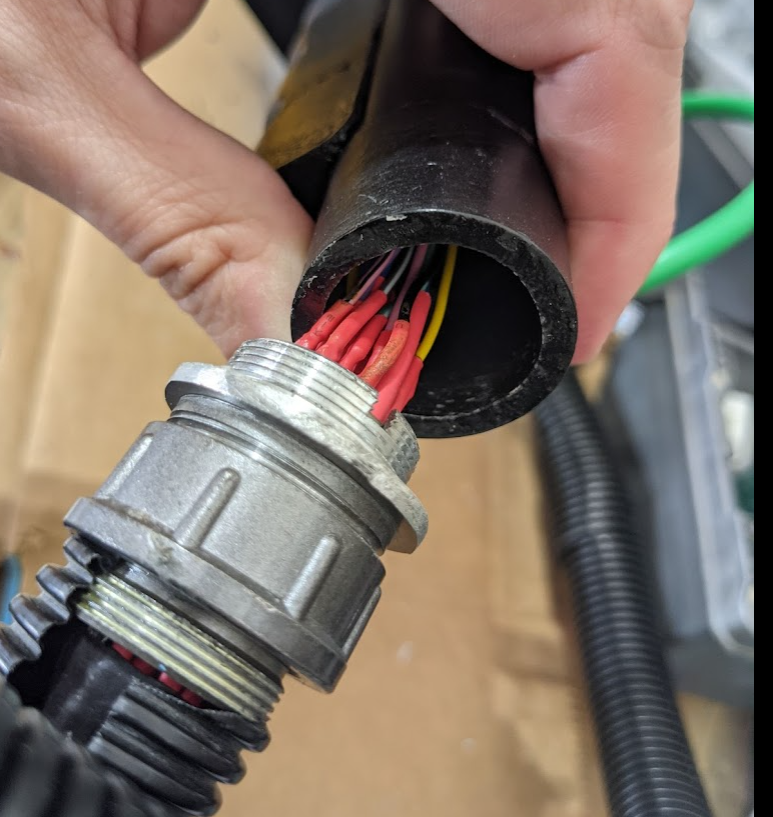

**Pack Internal Cable**
Parts
- 50cm Ribbon Cable Wand\Handle 30cm Ribbon Cable: https://www.amazon.com/gp/product/B07Q2SMN9H
- 20 pin Male Connector 
- 4x m3 screws

Do the same steps as above in the wand directions but don't grind the connector, and use the longer Ribbon cable. 

On my pack I didn't stem out the terminal pins, and I regret it.  You can see the ribbon wires are tiny and are barely connected. I will fix it once breaks off.   

Use the exiting hole, or create a new.  I used Dremel sander to widen the hole to fit the connector though. Then drill some holes for the m3 screws and attach it to the pack

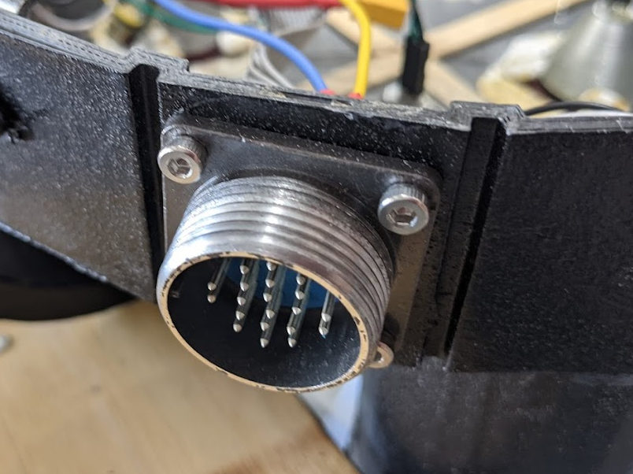
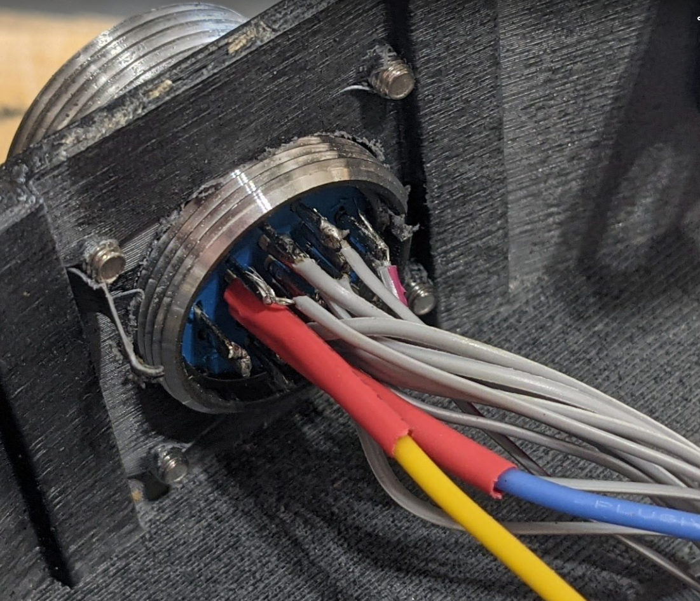

Here is the inside of my pack.  Follow the green line to find the audio connectors
- Yes, those are popcicle sticks used to to help brace the gaps)
- I used epoxy putty to keep the lenses, and lens cone reflectors to stay.. 
The Q-Pack is way better. Please use it for printing your pack.

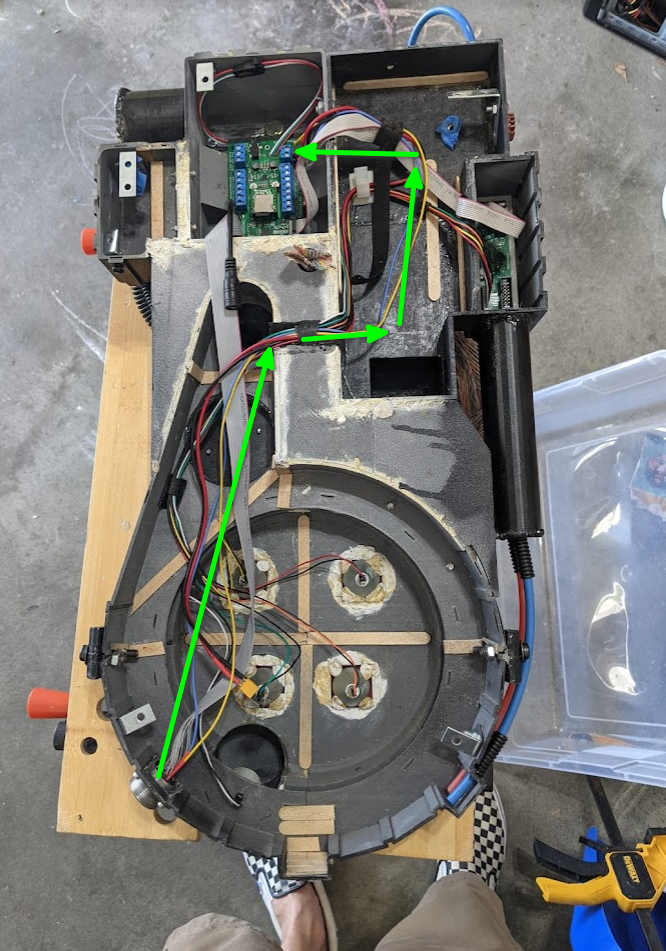

***The Connector cable***
The cable itself its quite simple. Its a straight through connection so match the wire colors to the pins. I suggest mapping it out first (eg.  Pin 1 = Blue-yellow, Pin 2 = Green-white).  

**TEST EACH CONNECTION AFTER SOLDERING!!** 
You don't want to redo this cable. It takes forever. 
Use a multi meter to ensure each wire working.  

The ends of my cable a slightly different. I removed the cable clamp off of one of the female connectors.That way the end that connects to the wand doesn't stick out further.  See the picture below. 

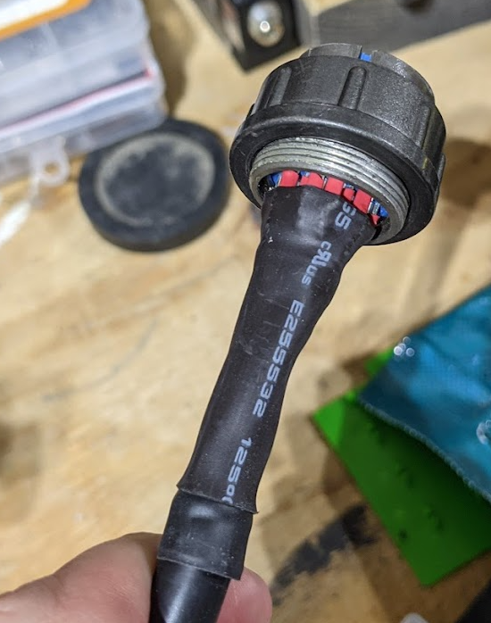
Be sure to put plenty of heat shrink tubing on the cable to keep it from breaking

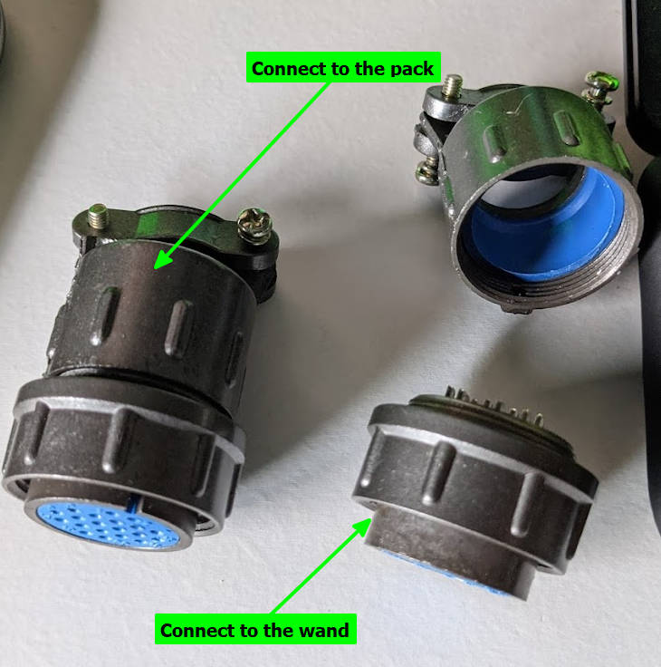
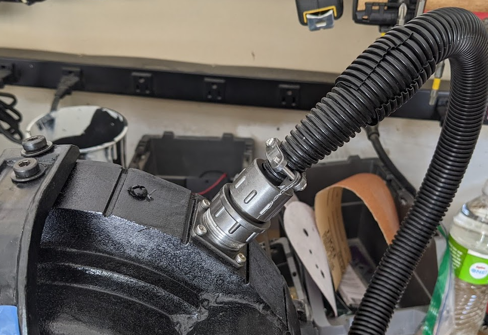
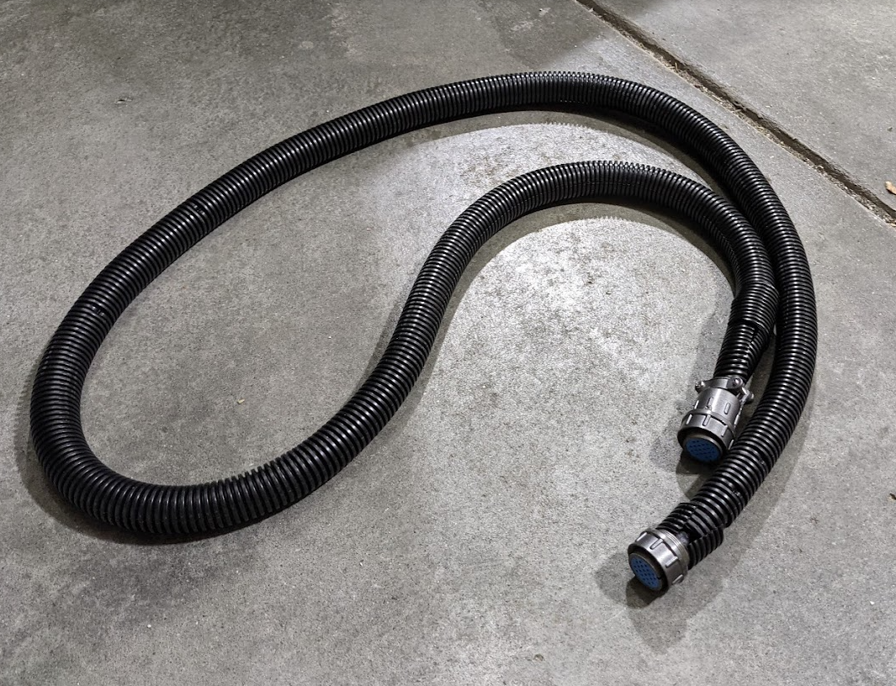
